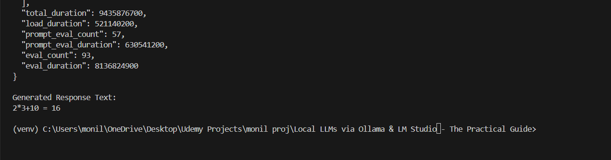
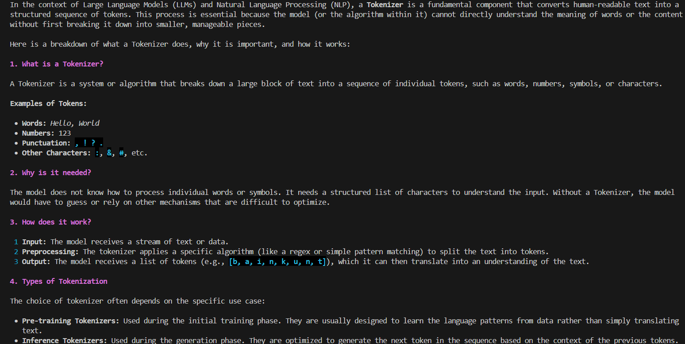
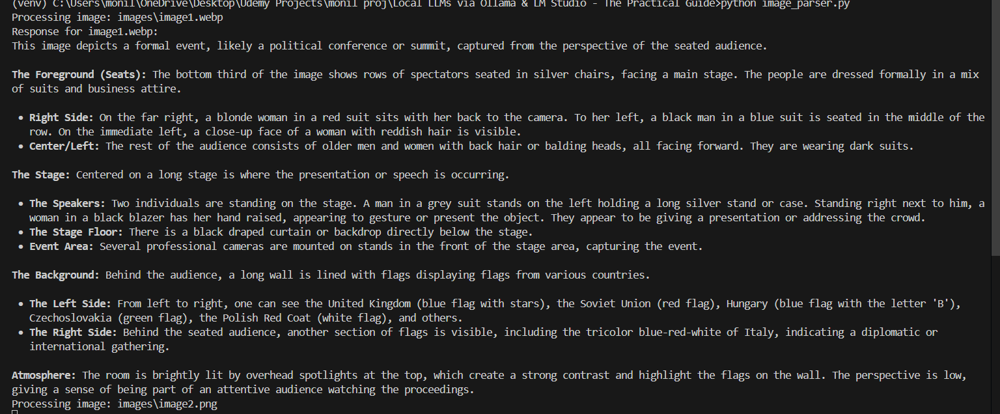

# Local LLMs Integration with Python script

This repository contains practical Python implementations for interacting with locally hosted Large Language Models (LLMs) using **Ollama**. It demonstrates how to utilize both Ollama's native REST API and its OpenAI-compatible endpoints to build entirely offline, privacy-first AI scripts.

## 🚀 Features & Scripts

The project consists of three main implementation strategies:

### 1. `basic.py` - OpenAI SDK Compatibility
Demonstrates how to swap out paid OpenAI endpoints for local Ollama endpoints using the official `openai` Python SDK. 
- Connects to `http://localhost:11434/v1`.
- Sends a system and user prompt to the local `qwen-nothink` model.
- Uses the `rich` library to render the response in beautifully formatted Markdown right in the terminal.

### 2. `ollama_api.py` - Native REST API Integration
Shows how to interact with Ollama natively without external AI SDKs.
- Uses the `requests` library to POST data to the `/api/generate` endpoint.
- Features an interactive command-line loop where the user can input custom prompts.
- Handles JSON parsing and error management.

### 3. `image_parser.py` - Local Vision Model Analysis
A powerful script that allows a local VLM to "see" and describe local images.
- Automatically scans an `images/` directory for `.png` and `.webp` files.
- Converts images into Base64 Data URIs.
- Passes the images alongside a prompt to the local AI for detailed descriptions.
- Renders the descriptions in terminal Markdown.

## 🛠️ Tech Stack

- **Python 3.x**
- **Ollama**: For running the local AI models (`qwen-nothink`).
- **OpenAI Python SDK**: Used as a standardized API wrapper for local models.
- **Requests**: For native HTTP API calls.
- **Rich**: For terminal styling and markdown rendering.

## ⚙️ Setup and Installation

1. **Install Ollama**  
   Ensure you have Ollama installed and running on your machine.

2. **Pull the required models**  
   You will need to pull the models referenced in the scripts (e.g., `qwen-nothink` or your model of choice):
   ```bash
   ollama run qwen-nothink
   ```

3. **Set up the Python Environment**  
   Create and activate a virtual environment:
   ```bash
   python -m venv venv
   # On Windows:
   venv\Scripts\activate
   # On Mac/Linux:
   source venv/bin/activate
   ```

4. **Install Dependencies**  
   Install the required Python packages from the `requirements.txt` file:
   ```bash
   pip install -r requirements.txt
   ```

## 💡 Usage
With the virtual environment active and Ollama running locally, simply execute any of the scripts:
```bash
python basic.py
python ollama_api.py
python image_parser.py
```

## Sample Outputs

<div align="center">
  <h3>Rest API Output</h3>
  
  <br><br>

  <h3>OpenAI SDK Output</h3>
  
  <br><br>

  <h3>Image Parser Output</h3>
  
</div>
